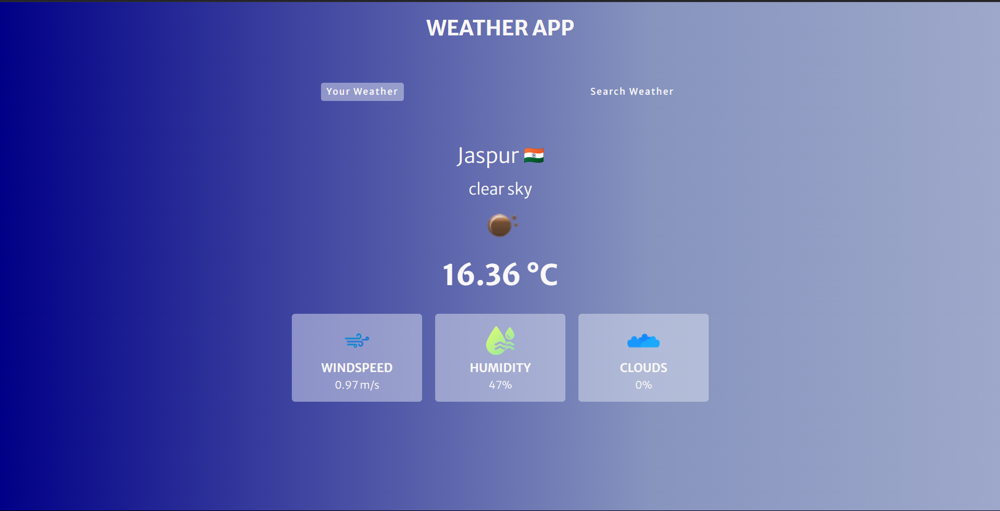
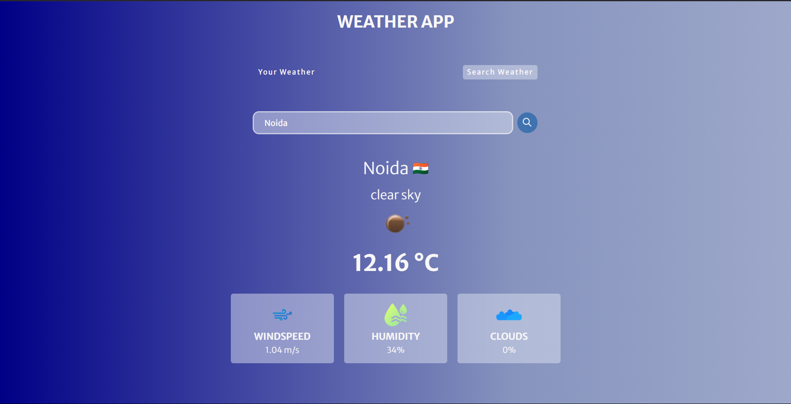
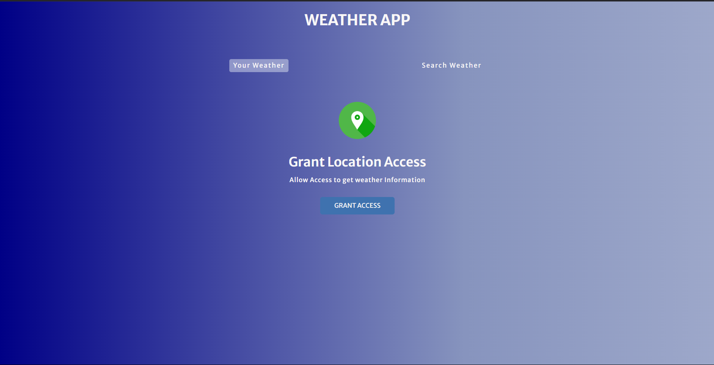

# Weather_App_By_Search_Location
A sleek, real-time weather app providing current temperature, humidity, wind speed, and more for any location. Built with React and powered by OpenWeather API, it features dynamic backgrounds, responsive design, and a user-friendly interface. Clone, set up your API key, and explore accurate weather updates effortlessly! 🌍✨

#Features 🌟
🌍 Real-Time Weather: View current temperature, humidity, wind speed, and more.
🔍 Search Functionality: Find weather details for any city or location.
🌈 Dynamic Backgrounds: Visuals change based on weather conditions (e.g., sunny, rainy).
📱 Responsive Design: Optimized for desktop, tablet, and mobile devices.

#Tech Stack 🛠️
Frontend: HTML JavaScript
Styling: CSS
API: OpenWeather API
Version Control: Git & GitHub

## Screenshots 📸  
Here’s a preview of the Weather App:  

  
  
  
